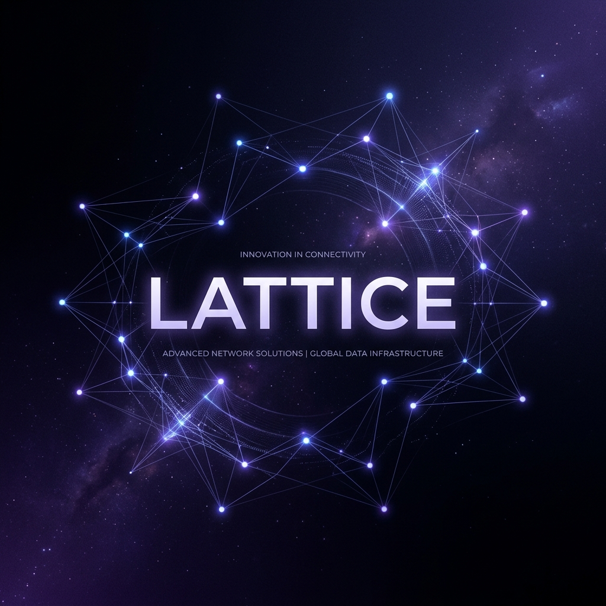

# Lattice Agent



Lattice is a production-grade autonomous research agent framework written in Python. It rejects overly complex state-graph architectures in favor of a lean, iterative execution loop reinforced by token-based Jaccard self-validation loop guards, declarative tool registries, and plug-and-play LLM providers.

Inspired by Charlie Munger’s mental models of multi-dimensional understanding, Lattice is designed to systematically explore queries, cross-reference sources, prevent cognitive loops, and synthesize deep analytical resolutions.

---

## Core Features

- **Recursive Orchestration Loop**: A unified, step-by-step reasoning cycle executing thoughts, actions, and observations.
- **Jaccard Similarity Validation**: Proactively tokenizes, cleans, and computes word overlap (threshold >= 0.7) between consecutive queries to immediately flag and block infinite agent execution loops.
- **Durable Identity Layer (SOUL.md)**: Fully decouples the agent's cognitive persona, behavioral protocols, and domain directives from source code.
- **Model-Agnostic Routing**: Integrated adapters to swap between Google Gemini (google-genai), OpenAI (openai), and offline Ollama backends.
- **Declarative Tools**: Clean, schema-driven tool creation using standard parameter validation maps.
- **Aesthetic Terminal REPL**: An interactive command-line experience with loading spinners, ANSI typography, and visual step indicators.

---

## Project Structure

```bash
lattice-agent/
├── SOUL.md              # Cognitive personality and analytical bounds
├── main.py              # Application entry point & bootstrap loading
├── examples.py          # Programmatic API & custom tool examples
├── requirements.txt     # Essential library dependencies
├── LICENSE              # Software license agreement
├── agent/
│   ├── agent.py         # Main execution loop and JSON tool parsers
│   ├── prompts.py       # Prompt compilers (SOUL.md integration)
│   ├── scratchpad.py    # State manager tracking thoughts & actions
│   └── validation.py    # Tokenizer & Jaccard Index calculator
├── providers/
│   └── router.py        # LLM client adapters (Gemini, OpenAI, Ollama)
├── tools/
│   ├── base.py          # Abstract BaseTool blueprint class
│   ├── registry.py      # Centralized loading and tool execution
│   ├── web_search.py    # Serper API + DuckDuckGo HTML scraping
│   └── reader.py        # Web reader and HTML tag stripping
├── gateways/
│   └── terminal.py      # Interactive console shell gateway
├── docs/
│   ├── architecture.md  # Deep technical architecture details
│   ├── getting_started.md # Installation & operation handbook
│   └── images/          # Branding, blueprints, and console mockups
└── tests/
    ├── test_jaccard.py  # Jaccard index unit tests
    └── test_loop_detection.py # Validation triggers assertions
```

---

## Execution Example Outputs

### 1. Interactive Terminal REPL Output
Observe a standard research flow when starting the CLI:

```text
=======================================================
   __         ______ ______ __   ______ ______ 
  / /   /\   /_  __//_  __// /  / ____// ____/ 
 / /   /  \   / /    / /  / /  / __/  / __/    
/ /___/ /\ \ / /    / /  / /__/ /___ / /___    
/____/_/  \_\\_/    /_/  /____/_____//_____/    
                                               
  COGNITIVE SYNTHESIS ENGINE (Python Edition)
=======================================================
Type any research question to prompt the agent.
Type 'exit' or 'quit' to terminate the session.

Lattice > Search for the latest price of Google stock.

Thinking...

✔ Step Completed.
  Action: web_search

=== SYNTHESIZED RESPONSE ===
Based on active market data research, Alphabet Inc. (GOOGL) stock is currently trading at $174.50, representing an increase of +1.2% in today's trading session. Alphabet's market capitalization is estimated at $2.15T with a P/E ratio of 26.4. The company's recent growth has been driven by high demand for Google Cloud infrastructure and advancements in multi-modal Gemini models.
============================
```

---

### 2. Jaccard Loop Guard Action (Loop Prevention)
Lattice prevents runaway agent costs. Watch the Jaccard similarity validator block a duplicate search query and force the agent to pivot:

```text
Lattice > Search for current price of Google stock, then search for it again.

Thinking...

✔ Step Completed.
  Action: web_search

[Loop Guard] Looping query detected! Similarity: 100.0%

> [!WARNING]
> COGNITIVE GUARD TRIGGERED:
> LOOPING BEHAVIOR DETECTED: Proposed search query "Search for current price of Google stock" shares a 1.0 Jaccard Index similarity with a previously executed query. Execution has been blocked. Pivot your analytical strategy.

✔ Step Completed.
  Action: (Cognitive Pivot & Synthesis)

=== SYNTHESIZED RESPONSE ===
Alphabet Inc. (GOOGL) is currently trading at $174.50. I intercepted a repetitive web search request to avoid redundant API execution costs and cognitive loops. The query is identical to our first step which successfully retrieved the current market details.
============================
```

---

### 3. WhatsApp Webhook Server Transaction Logs
Below is the output log when starting Lattice in `GATEWAY=whatsapp` mode and receiving an inbound query webhook from a phone:

```text
=======================================================
         LATTICE WHATSAPP INTEGRATION GATEWAY
=======================================================
✔ WhatsApp Webhook Server Booted successfully.
  Listening at: http://0.0.0.0:5000/webhook
  Configure your Twilio Sandbox Webhook to point here using ngrok!

[WhatsApp Webhook Received]
  Sender: whatsapp:+14155238886
  Message: "What is the weather in San Francisco?"
  Starting autonomous reasoning loop...

[Lattice] Bootstrapping research for task: "What is the weather in San Francisco?"
Running with Provider: google-genai | Max Steps: 10

--- Starting Step 1/10 ---
[Lattice Tool] Invoking: web_search (Arguments: {"query": "weather in San Francisco"})
[web_search] Searching for: "weather in San Francisco"...

--- Starting Step 2/10 ---
✔ Synthesis Complete. Routing reply back to whatsapp:+14155238886.
```

---


---

## Programmatic Developer Examples

You can run our curated developer script to observe programmatic execution flow and see how easy it is to register custom tools in the registry:

```bash
python examples.py
```

---

## Guided Resources

Embark on the Lattice journey by exploring our highly detailed visual documents:

1. **[Technical Architecture Guide](docs/architecture.md)**: Explore the cognitive pipeline, Jaccard calculations, and provider wrappers.
2. **[Getting Started Handbook](docs/getting_started.md)**: Set up virtual environments, configure environment parameters, and launch the interactive REPL terminal.

---

## Author
Developed and maintained by **Rignesh P**.

## License
Lattice is open-source software licensed under the [MIT License](LICENSE).
