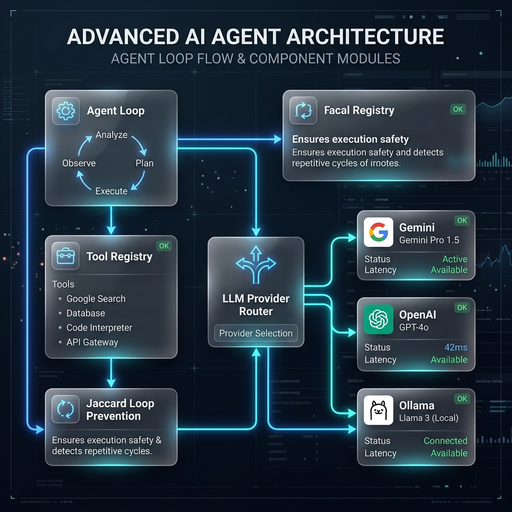

# Lattice Technical Architecture

Welcome to the technical blueprint of Lattice. Whether you are a system architect or an aspiring developer writing your first agent, this guide explains how the different parts of the Lattice framework connect to form a cohesive, intelligent system.

Here is your visual guide to the system layout:

---

## System Philosophy: Keep It Simple

In modern software development, AI agents are sometimes built using complex, hard-to-debug flowcharts (often called state-graphs or DAGs). 

Lattice takes a different approach: **linear simplicity**. 

Instead of jumping between complex branches, Lattice runs a straightforward, step-by-step loop. Each step is carefully checked by a set of mathematical guardrails to keep the agent focused, safe, and efficient.

---

## Component Breakdown

### 1. The Core Agent Loop (`agent/agent.py`)
This is the central engine of the system. Think of it as a coordinator. 

When you submit a question, this loop compiles your system instructions (who the agent is) and your current task into a format the AI model can understand. It manages this interaction in a maximum number of steps (usually 10), deciding at each turn whether to execute a tool (like searching the web) or present a final synthesized answer to you.

---

### 2. Jaccard Loop Guard (`agent/validation.py`)
This is the safety officer of Lattice, and one of its most important innovations. 

#### The Problem: Cognitive Loops
A common issue with autonomous agents is that they can get stuck in a "cognitive loop." For example, if a search result does not contain the exact answer they are looking for, the model might get confused and call the exact same search query again and again, wasting your time and API tokens.

#### The Solution: Tokenized Overlap Similarity
Before any tool is executed, Lattice takes the proposed search term (e.g., `"latest stock price of Google"`) and compares it against all previous search terms in its history. 

It does this using a simple mathematical formula called the **Jaccard Index**:

$$\text{Jaccard Index} = \frac{\text{Common Words}}{\text{Total Unique Words}}$$

1. **Standardize**: The system strips out punctuation and generic words (like *for, standard, the, lookup*).
2. **Compute**: It checks how many core words overlap between the new query and prior queries.
3. **Intercept**: If the overlap is too high (70% or more), Lattice instantly blocks the execution. It inserts a bold warning directly into the agent's memory (e.g., *"Warning: You are repeating yourself. Try a different query or summarize what you have"*). This forces the AI model to dynamically pivot and change its strategy in the very next step.

---

### 3. Decoupled Provider Router (`providers/router.py`)
Lattice is designed to be model-agnostic. This means you are never locked into a single AI vendor. 

The router provides a uniform interface (`LLMProvider`) that maps all internal agent communication to standard formats. You can switch your backend model in the `.env` configuration file to adapt to your needs:
- **Google Gemini**: Uses the official `google-genai` SDK to run highly optimized, rapid reasoning models (like `gemini-2.5-flash`).
- **OpenAI**: Connects to the standard `openai` API.
- **Ollama**: Enables the agent to run completely offline on your own local computer using open-source models like Llama 3.

---

### 4. Declarative Tool Registry (`tools/registry.py`)
Tools are the hands and eyes of the agent. 

To keep the system modular, every tool (like `web_search.py` or `reader.py`) is written as an isolated, standard class. 
- Each tool defines a clean JSON parameter schema detailing what inputs it expects.
- The **Tool Registry** acts as a centralized library. When the agent requests a tool call, the registry automatically validates the arguments, runs the tool, catches any errors gracefully so the system does not crash, and returns the result as a text string back to the agent loop.
